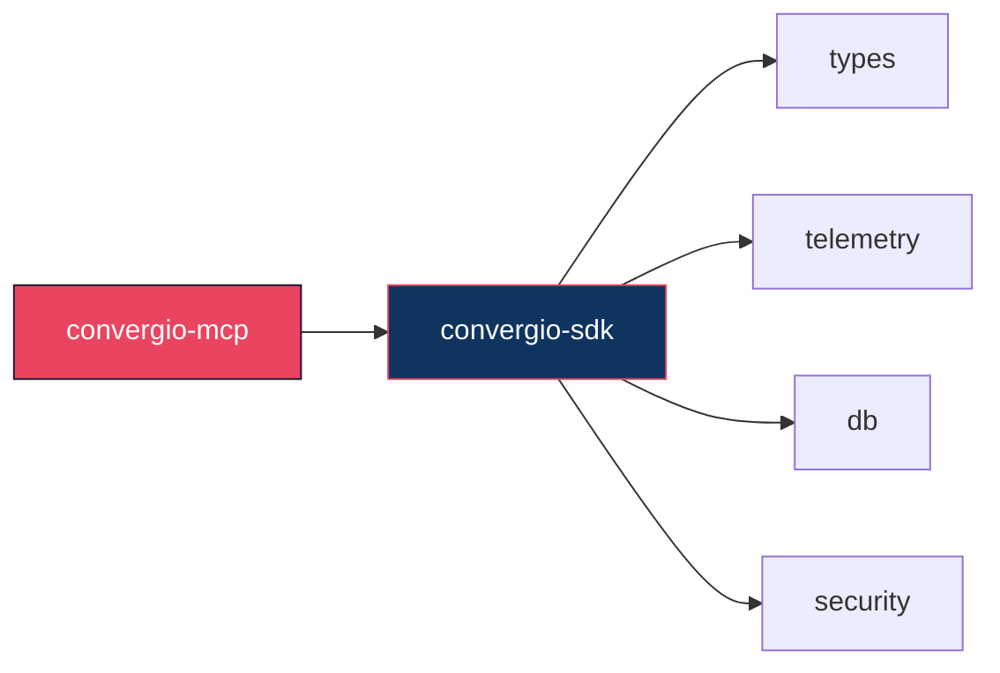

# convergio-mcp

[](https://github.com/Roberdan/convergio-mcp/actions/workflows/ci.yml)
[](https://github.com/Roberdan/convergio-mcp/blob/main/LICENSE)
[](https://www.rust-lang.org/)
[](#)

MCP server for Convergio — exposes daemon tools via rmcp SDK

Part of the [Convergio](https://github.com/Roberdan/convergio) ecosystem.

## Architecture



## Quality gates

| Gate | Status |
|------|--------|
| Zero warnings (`-Dwarnings`) | CI enforced |
| All tests (unit + integration) | CI enforced |
| Dependency audit (`cargo audit`) | CI enforced |
| License policy (`cargo deny`) | CI enforced |
| Format (`cargo fmt`) | CI enforced |
| Auto-release | release-please |

## Usage

```toml
[dependencies]
convergio-mcp = { git = "https://github.com/Roberdan/convergio-mcp", tag = "v0.1.0" }
```

## Development

```bash
cargo fmt --all -- --check
RUSTFLAGS="-Dwarnings" cargo clippy --workspace --all-targets --locked
cargo test --workspace --locked
cargo deny check
```

## Related

- [convergio-sdk](https://github.com/Roberdan/convergio-sdk) — Core types, telemetry, security, db
- [convergio](https://github.com/Roberdan/convergio) — Main daemon

## License

Convergio Community License v1.3 — see [LICENSE](LICENSE).

---

## Agentic Manifesto

See the full [Agentic Manifesto](https://github.com/Roberdan/convergio/blob/main/AgenticManifesto.md) — the guiding philosophy behind Convergio.

---

© 2025-present Roberto D'Angelo. All rights reserved.
